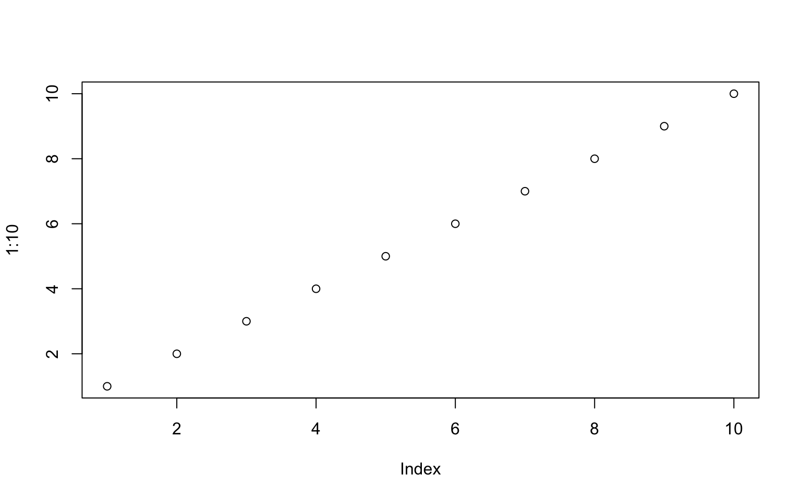
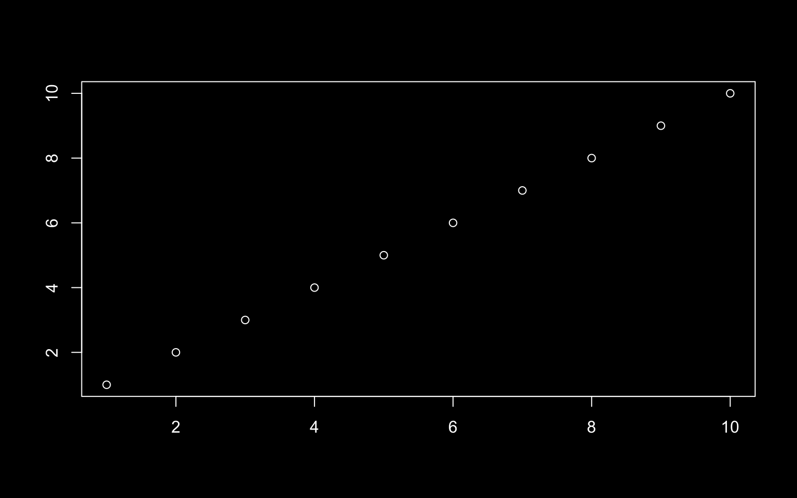

Quarto 1.7 is out! You can get the current release from the [download page](http://quarto.org/docs/download/index.html).

We are especially enthusiastic about the improvements 1.7 brings to dark mode: you can now specify light and dark themes via brand, map computational outputs to themes, and have your website theme follow your viewer's preference.
To celebrate these changes, this site, [quarto.org](../../..), now has a light and dark mode.
Toggle the switch in the navigation bar (<i class="bi bi-toggle-off"></i>) to see the difference.

You can read about these improvements and some other highlights below. You can find all the changes in this version in the [Release Notes](http://quarto.org/docs/download/changelog/1.7/).

## Dark Mode Improvements

### Specify light and dark themes via **brand.yml**

You can now specify a light and dark brand.
For example, at a project-level you can provide two brand files:

**\_quarto.yml**

``` yaml
brand:
  light: light-brand.yml
  dark: dark-brand.yml
```

Standalone HTML pages, websites, and dashboards will gain a light switch toggle allowing viewers to switch between the light and dark themes.

<table>
<colgroup>
<col style="width: 50%" />
<col style="width: 50%" />
</colgroup>
<tbody>
<tr>
<td style="text-align: left;"><div width="50.0%" data-layout-align="left">
<figure>

<figcaption aria-hidden="true"><code>light</code> brand</figcaption>
</figure>
</div></td>
<td style="text-align: left;"><div width="50.0%" data-layout-align="left">
<figure>

<figcaption aria-hidden="true"><code>dark</code> brand</figcaption>
</figure>
</div></td>
</tr>
</tbody>
</table>

By default Typst documents will use the light brand, but you can set the `brand-mode` option to use the dark brand instead:

**document.qmd**

``` yaml
---
format:
  typst:
    brand-mode: dark
---
```

Read about other ways to set a light and dark brand in [Guide \> Brand](http://quarto.org/docs/authoring/brand.html#dark-brand).

### Map computational outputs to themes

A new code cell option, `renderings`, allows you to indicate which computational outputs should be displayed in light and dark mode.
Create light and dark versions of your outputs in a single code cell,
and add the option `renderings` to specify the order of the outputs.
For example, this cell creates a `light` version of a plot,
then a `dark` version:

```` markdown
```{r}
#| renderings: [light, dark]
plot(1:10) # Shown in `light` mode

par(bg = "#000000", fg = "#FFFFFF", col.axis = "#FFFFFF")
plot(1:10) # Shown in `dark` mode
```
````





Both outputs are produced, but you'll only see the one corresponding to the current state of the light switch.
Toggle the switch in the navigation bar to see the image change to reflect the theme.

### Respect user color scheme

Set the new `html` format option `respect-user-color-scheme` to `true` if you would like your site to honor the viewer's operating system or browser preference for light or dark mode:

**\_quarto.yml**

``` yaml
format:
  html:
    respect-user-color-scheme: true
```

## Other Highlights

-   Typst updated to 0.13.0

-   Pandoc updated to 3.6.3

-   New [`version` shortcode](http://quarto.org/docs/authoring/version.html) to insert the version of Quarto used to build your document:

    <table>
    <colgroup>
    <col style="width: 50%" />
    <col style="width: 50%" />
    </colgroup>
    <tbody>
    <tr>
    <td style="text-align: left;"><div width="50.0%" data-layout-align="left">
    <div class="sourceCode" id="cb1" data-shortcodes="false"><pre class="sourceCode markdown"><code class="sourceCode markdown"><span id="cb1-1"><a href="#cb1-1" aria-hidden="true" tabindex="-1"></a>Rendered with Quarto {{&lt; version &gt;}}</span></code></pre></div>
    </div></td>
    <td style="text-align: left;"><div class="border p-1" width="50.0%" data-layout-align="left">
    <p>Rendered with Quarto 1.8.27</p>
    </div></td>
    </tr>
    </tbody>
    </table>

-   Updated LaTeX and Beamer template partials:

    -   [LaTeX partials](http://quarto.org/docs/journals/templates.html#latex-partials)
    -   [Beamer partials](http://quarto.org/docs/journals/templates.html#beamer-partials)

    These changes reflect the updates made in Pandoc 3.5 to separate the LaTeX and Beamer document templates and introduce some additional partials for both.
    If you have custom formats that provide custom templates or partials, you may need to update them to work with the new partials.

-   Improvements to the `julia` engine:

    -   [`juliaup` integration](http://quarto.org/docs/computations/julia.html#juliaup-integration): Use specific versions of Julia in your notebooks.

    -   [R and Python support](http://quarto.org/docs/computations/julia.html#r-and-python-support): Include `{r}` and `{python}` executable code cells via the RCall and PythonCall packages.

    -   [Caching](http://quarto.org/docs/computations/julia.html#caching-julia): Save time rendering long-running notebooks by caching results.

    -   [Revise.jl integration](http://quarto.org/docs/computations/julia.html#revise.jl-integration): Automatically update function definitions in Julia sessions.

## Acknowledgements

We'd like to say a huge thank you to everyone who contributed to this release by opening issues and pull requests:

[AndreasThinks](https://github.com/AndreasThinks),
[ArthurData](https://github.com/ArthurData),
[BrendonChau](https://github.com/BrendonChau),
[DanStuder](https://github.com/DanStuder),
[DavidFirth](https://github.com/DavidFirth),
[Eli-78-fas](https://github.com/Eli-78-fas),
[EllaKaye](https://github.com/EllaKaye),
[EmilHvitfeldt](https://github.com/EmilHvitfeldt),
[EvoArt](https://github.com/EvoArt),
[FMKerckhof](https://github.com/FMKerckhof),
[FrankwaP](https://github.com/FrankwaP),
[JanPalasek](https://github.com/JanPalasek),
[Jocarnail](https://github.com/Jocarnail),
[MHellmund](https://github.com/MHellmund),
[MichaelHatherly](https://github.com/MichaelHatherly),
[Noghpu](https://github.com/Noghpu),
[PeneLoopy](https://github.com/PeneLoopy),
[Rafnuss](https://github.com/Rafnuss),
[SergeCroise](https://github.com/SergeCroise),
[TonyFly3000](https://github.com/TonyFly3000),
[actuaristai](https://github.com/actuaristai),
[alex-r-bigelow](https://github.com/alex-r-bigelow),
[andrewheiss](https://github.com/andrewheiss),
[ant-durrant](https://github.com/ant-durrant),
[antoine4ucsd](https://github.com/antoine4ucsd),
[arnaudgallou](https://github.com/arnaudgallou),
[aronatkins](https://github.com/aronatkins),
[arthurgailes](https://github.com/arthurgailes),
[bkowshik](https://github.com/bkowshik),
[boshek](https://github.com/boshek),
[cbrnr](https://github.com/cbrnr),
[cl-roberts](https://github.com/cl-roberts),
[cmadland](https://github.com/cmadland),
[coatless](https://github.com/coatless),
[deepayan](https://github.com/deepayan),
[devmcp](https://github.com/devmcp),
[dhimmel](https://github.com/dhimmel),
[dkapitan](https://github.com/dkapitan),
[dmenne](https://github.com/dmenne),
[eamcvey](https://github.com/eamcvey),
[edavidaja](https://github.com/edavidaja),
[fredguth](https://github.com/fredguth),
[fuhrmanator](https://github.com/fuhrmanator),
[gadenbuie](https://github.com/gadenbuie),
[github-actions\[bot\]](https://github.com/apps/github-actions),
[glin](https://github.com/glin),
[gwbrck](https://github.com/gwbrck),
[hchulkim](https://github.com/hchulkim),
[hguturu](https://github.com/hguturu),
[hturner](https://github.com/hturner),
[ihrke](https://github.com/ihrke),
[jdutant](https://github.com/jdutant),
[jenslaufer](https://github.com/jenslaufer),
[jkrumbiegel](https://github.com/jkrumbiegel),
[jmgirard](https://github.com/jmgirard),
[joelostblom](https://github.com/joelostblom),
[kandolfp](https://github.com/kandolfp),
[kapsner](https://github.com/kapsner),
[kazuyanagimoto](https://github.com/kazuyanagimoto),
[kdheepak](https://github.com/kdheepak),
[kingo55](https://github.com/kingo55),
[knuesel](https://github.com/knuesel),
[kubu4](https://github.com/kubu4),
[kv9898](https://github.com/kv9898),
[kylie-foster](https://github.com/kylie-foster),
[loneguardian](https://github.com/loneguardian),
[lwjohnst86](https://github.com/lwjohnst86),
[ma2048](https://github.com/ma2048),
[markjholmes](https://github.com/markjholmes),
[maurosilber](https://github.com/maurosilber),
[mipmip](https://github.com/mipmip),
[mroavi](https://github.com/mroavi),
[mroberts1](https://github.com/mroberts1),
[msh855](https://github.com/msh855),
[mvuorre](https://github.com/mvuorre),
[nathanj3](https://github.com/nathanj3),
[odysseu](https://github.com/odysseu),
[parmsam](https://github.com/parmsam),
[peter-gy](https://github.com/peter-gy),
[pvelayudhan](https://github.com/pvelayudhan),
[raffaem](https://github.com/raffaem),
[robmcd](https://github.com/robmcd),
[ryanzomorrodi](https://github.com/ryanzomorrodi),
[stragu](https://github.com/stragu),
[sun123zxy](https://github.com/sun123zxy),
[t-kalinowski](https://github.com/t-kalinowski),
[temospena](https://github.com/temospena),
[tjni](https://github.com/tjni),
[torven-schalk](https://github.com/torven-schalk),
[turcotte](https://github.com/turcotte),
[wenyaoliu](https://github.com/wenyaoliu),
[yhkee0404](https://github.com/yhkee0404).
