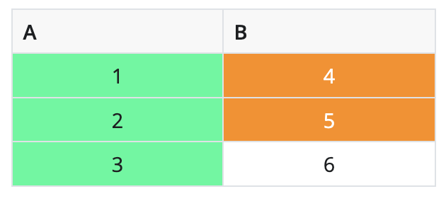
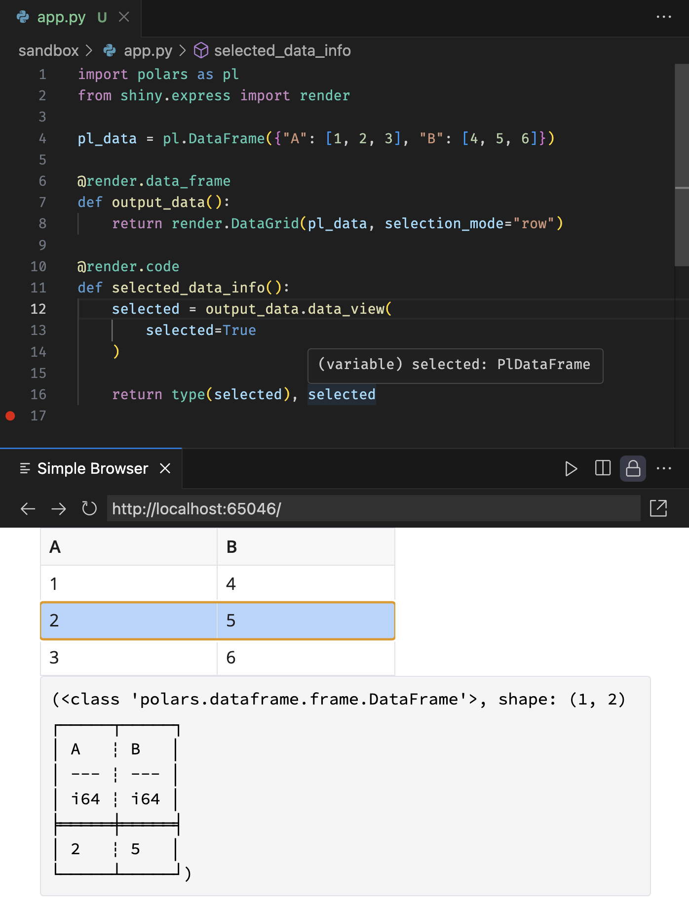
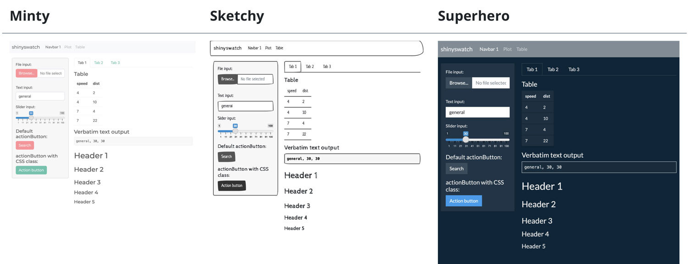

It's time for another Shiny for Python release! Not only does this release include a number of exciting features and big improvements, it's also the release we're choosing to call Shiny for Python v1.0.

In this post, we'll talk about what v1.0 means to us, and then get into the feast of new features we have for you!

* **[What does it mean to hit v1.0?](#what-does-it-mean-to-hit-v1.0)**
* **[New `Chat()` component](#new-chat-component)**
* **[End-to-end testing](#end-to-end-testing)**
* **[Data frame improvements](#data-frame-improvements)**
* **[Multimedia components](#multimedia-components)**
* **[Modules for Express](#modules-for-express)**
* **[Use Bootswatch themes with shinyswatch](#use-bootswatch-themes-with-shinyswatch)**

---

## What does it mean to hit v1.0?

For the Shiny team, bestowing the "v1.0" label on a piece of software is a declaration of a certain level of quality, feature completeness, and API stability.

In April 2023, we [removed the alpha tag from Shiny for Python](https://shiny.posit.co/blog/posts/shiny-python-general-availability/), signaling our team's belief that its level of quality and runtime stability made it appropriate for production use. And that belief has borne out: the feedback we've received from real-world users of the framework has been overwhelmingly positive.

At that time, we chose not to use a 1.0 moniker, preferring to stick to 0.x until after we had shipped essential features like [interactive data tables](../shiny-python-0.4.0/) (June 2023) and [dashboard UI components](../shiny-python-0.6.0/) (Nov 2023). And soon after that, we came up with [Shiny Express](https://shiny.posit.co/blog/posts/shiny-express/), a completely new syntax for writing Shiny apps, which meant another period of heavy feedback and potential revisions of the API.

Sitting here in July 2024, it feels like a great time to acknowledge Shiny for Python's maturity by bestowing it with the big 1-point-0. The API feels appropriately stable now, and most of the new features of the last few releases have been about building on top of Shiny's existing API design vocabulary, rather than extending or changing it (although one notable brand-new primitive is Modules for Shiny Express, which you can read about below).

So please join us in raising a proverbial glass to Shiny for Python 1.0! And if you've been waiting on the sidelines, now is a great time to [get in the game](https://shiny.posit.co/py/docs/overview.html)!

And now, let's take a look at all the cool features that are part of this release!

---

## New `Chat()` component

The new `Chat()` component makes it easy to implement generative AI chatbots, powered by any LLM of your choosing. For a comprehensive overview, see the new [component page](https://shiny.posit.co/py/components/display-messages/chat/).

The main steps of any generative AI chatbot are:

1. Create a `Chat` instance.
2. Display the chat `.ui()`.
3. Define a `on_user_submit` callback.
   - This callback typically passes `.messages()` to a generative AI model (`ai_model`) and appends the result to the chat.
   - The `ai_model` can be anything, but `Chat` makes it especially easy to use interfaces from OpenAI, Anthropic, Google, LangChain, and Ollama.

```python
from shiny.express import ui

chat = ui.Chat(id="chat")
chat.ui()

@chat.on_user_submit
async def _():
    messages = chat.messages()
    # The next line is a placeholder for the actual generative AI model
    response = await ai_model.generate_response(messages, stream=True)
    # Use append_message_stream() when streaming responses
    await chat.append_message_stream(response)
```

The generative AI [quickstart](https://shiny.posit.co/py/components/display-messages/chat/#ai-quick-start) has a variety of `ai_model` implementations, but we do recommend starting with [LangChain](https://www.langchain.com/), as it helps standardize response generation across different LLMs. Use the terminal command below to get the LangChain (with OpenAI) template:

```bash
shiny create -g https://github.com/posit-dev/py-shiny/tree/main/examples/chat/hello-providers/langchain
```

Then, follow the instructions at the top of `app.py` to set up your OpenAI API key before running the app. Once you have your credentials set up and [run the app](https://shiny.posit.co/py/docs/install-create-run.html) and start chatting!

<video src="chat2.mp4" class="border rounded img-fluid" controls></video>

The template above is a great starting point for building your own generative AI chatbot. To learn how to do more advanced things with `Chat` (e.g., system messages, RAG, etc), check out the [component page](https://shiny.posit.co/py/components/display-messages/chat/).

For now, `ui.Chat()` is limited to textual input and output. We hope to expand this in the future to include more complex inputs and outputs, such as images, videos, and audio (for now, you can checkout [shinymedia](#multimedia-components) for video in / audio out). We also hope to get [your feedback](https://discord.com/invite/yMGCamUMnS) on what you'd like to see in future versions of `Chat`!

---

## End-to-end testing

After more than a year of development and internal testing, we're now exporting an end-to-end testing framework for Shiny apps. End-to-end tests are a great way to maintain code quality by ensuring that apps behave as expected in response to (simulated) user interactions in a real browser. Our approach builds on the fabulous [Playwright](https://playwright.dev/) framework, which provides a fast, powerful, and resilient foundation for browser-based testing.

The video below demonstrates the experience of writing an end-to-end test for a Shiny app. Note that the new `shiny.playwright` module is where you can find dozens of "controllers" that make it easy to mimic user interactions with Shiny [components](https://shiny.posit.co/py/components/) and assert their expected state.

<video src="leverage_controllers.mp4" class="border rounded img-fluid" controls></video>

For a comprehensive overview of end-to-end testing, see the new article on [End-to-end testing in Shiny](https://shiny.posit.co/py/docs/end-to-end-testing.html).

---

## Data frame improvements

Shiny provides two components for rendering data frames: [`DataGrid()`](https://shiny.posit.co/py/components/outputs/data-grid/) and [`DataTable()`](https://shiny.posit.co/py/components/outputs/data-table/). The former is a more interactive and feature-rich table, while the latter is a simpler, more lightweight table. All of the improvements described below are available to both components.

### Styling

`DataGrid()` and `DataTable()` gain a `styles` argument for styling the displayed result. `styles` can take a list of dictionaries where each dictionary represents a style to be applied to the table (and thus should have at least a `style` (or `class`) key to apply CSS styles or classes to the relevant cells). To scope the styling to particular cells, use the `rows` and `cols` keys (with 0-based indexing). Note that if both `rows` and `cols` are specified, the style will be applied only to the intersection of the specified rows and columns.

```python
render.DataGrid(
    pd.DataFrame({"A": [1, 2, 3], "B": [4, 5, 6]}),
    styles=[
        # Center the text of each cell (using Bootstrap utility class)
        {
            "class": "text-center",
        },
        # Highlight 1st column green
        {
            "cols": [0],
            "style": {"background-color": "mediumspringgreen"},
        },
        # Highlight rows 1-2 within 2nd column
        {
            "rows": [0, 1],
            "cols": [1],
            "style": {"background-color": "darkorange", "color": "white"},
        },
    ],
)
```



### Selection & editing

It's now possible to enable both selection and editing simultaneously! 🎉

```python
render.DataGrid(
    pd.DataFrame({"A": [1, 2, 3], "B": [4, 5, 6]}),
    selection_mode="row",
    editable=True,
)
```

<video src="data-frame-edit-selection.mp4" class="border rounded img-fluid" controls></video>

Note that a row/cell can be selected by clicking on it, and a cell can be edited by double-clicking on it. Also, keyboard nativigation works as expected: use the arrow keys to navigate the table, press `Enter` to start editing a cell, and press `Esc` to cancel editing.

### Polars & typing support

Both `DataGrid()` and `DataTable()` now support [Polars](https://pola.rs/) DataFrames in addition to [pandas](https://pandas.pydata.org/) DataFrames. Also, accessor methods like `.data()` and `.data_view()` now return the same type as the rendered data. This even works with type hints, meaning your IDE will know the correct return type of the accessor. See the screenshot below for an example, and note the `polars` type hint in the tooltip.



### More control over sorting and filtering

It's now easier than ever to access and manipulate the sorting and filtering state of the table. Here are a few new methods to access that state more easily:

- `.data_view_rows()`: Reactive value representing the sorted and filtered row numbers.
- `.sort()`: Reactive value representing the sorted column information.
- `.filter()`: Reactive value representing the filtered column information.

And, to programmatically update the sorting and filtering:

- `.update_sort(sort=)`: Update the sorting of the data frame.
- `.update_filter(filter=)`: Update the filtering of the data frame.

Note that these methods (as well as other methods for accessing and manipulating state), are placed on the render function. Here's an example of having a button that sorts the data frame on column 0 in ascending order:

```python
import pandas as pd
from shiny import reactive
from shiny.express import input, render, ui

@render.data_frame
def df():
    return pd.DataFrame({"A": [1, 3, 2], "B": [4, 5, 6]})

@reactive.effect
@reactive.event(input.sort)
async def update_sort():
    await df.update_sort([{"col": 0, "desc": False}])

ui.input_action_button("sort", "Sort on column 0↑")
```

### Learn more

For a comprehensive overview of new and old data frame features, see the updated articles on [DataGrid](https://shiny.posit.co/py/components/outputs/data-grid/) and [DataTable](https://shiny.posit.co/py/components/outputs/data-table/).

---

## Multimedia components

A couple of months ago, a couple of our developers had the privilege of joining one of our favorite data science YouTubers, [Tina Huang](https://www.youtube.com/@TinaHuang1), on one of her livestreams. Tina challenged us to livecode a Shiny app that provides a video assistant chat UI backed by GPT-4o, like a basic version of the widely viewed [OpenAI demo](https://www.youtube.com/live/DQacCB9tDaw?si=AG6luavMRxkitS9I&t=584) that had just dropped.

Spoiler: we were fairly successful, and you can experience the result in this [live demo](https://jcheng.shinyapps.io/multimodal/).

Our assistant app takes webcam video as input, and plays audio as output. To make this a nice polished experience, we created a pair of Shiny-enabled web components to serve as input/output:

- `input_video_clip()`: A video preview of your webcam, with a button that lets you start/stop recording, and a settings menu that lets you choose the camera/microphone.
- `audio_spinner()`: An audio player than spins and pulses in sync with the audio signal.

<div style="max-width: min(400px, 100%);" class="border rounded p-2 pb-0 mb-4 mx-auto">

</div>

These components are now available in a standalone package called [shinymedia](https://posit-dev.github.io/shinymedia/). They're designed to be super easy to drop into your Shiny for Python app, no different than any input/output component that comes with Shiny.

As for the livestream, we had a lot of fun and the feedback was great from everyone in the audience. It's astonishing how easy this app was to build, once we had the right widgets. If you're at all interested in building AI apps with Shiny, [be sure to check out the recording](https://www.youtube.com/watch?v=OLTgI6DAQ_A)!

---

## Modules for Express

When it comes to building more complicated Shiny applications, some of the most useful tools at your disposal are Shiny modules. You can use Shiny modules to build components that abstract away complexity and can be reused in your applications.

Shiny Express now has support for using Shiny modules, and you can even create Shiny modules using Express syntax. To learn more, see our documentation on [Shiny modules](https://shiny.posit.co/py/docs/modules.html).

---

## Use Bootswatch themes with shinyswatch



We're also happy to announce [the release of shinyswatch v0.7.0](../../../blog/posts/shinyswatch-0.7.0/index.html). shinyswatch brings Bootswatch themes to Shiny for Python, allowing you to customize the appearance of your Shiny apps with a variety of themes.

---

We're thrilled to bring you these new features and improvements in Shiny for Python 1.0. As always, if you have any questions or feedback, please [join us on Discord](https://discord.gg/yMGCamUMnS) or [open an issue on GitHub](https://github.com/posit-dev/py-shiny/issues/new). Happy Shiny-ing!
